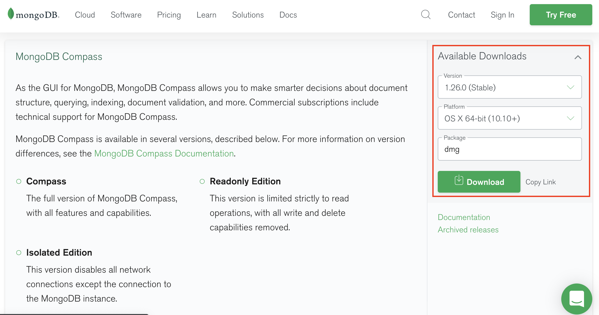
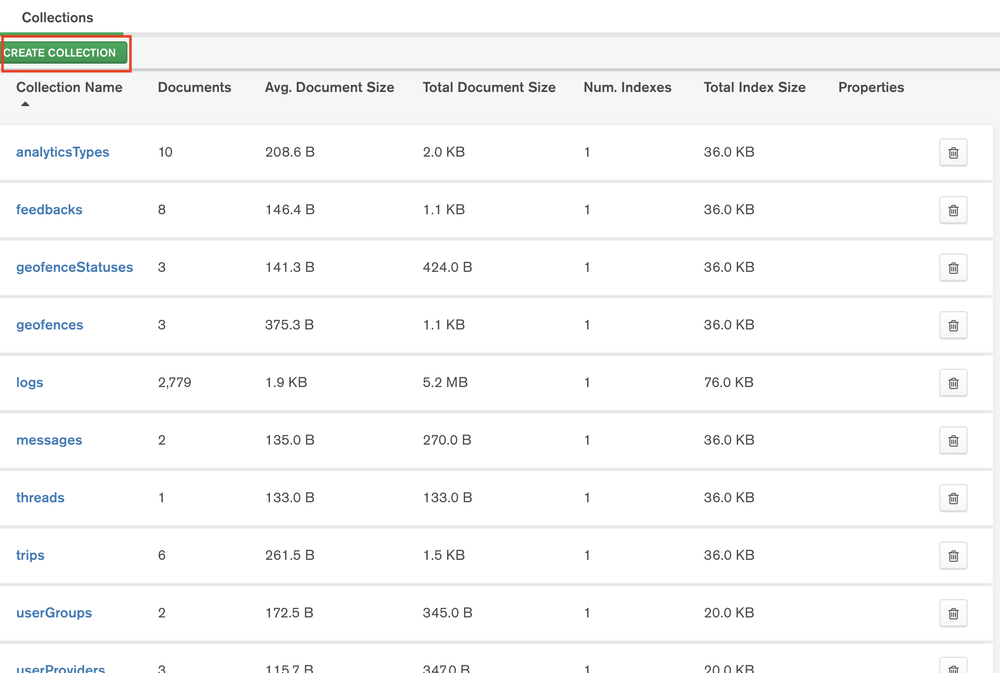

# Cauayan City eScooter API
Backend for Cauayan City eScooter web and mobile apps.

## Setup Requirements
1. Prepare your server instance (In-house or Cloud). Recommended is Linux with 8GB RAM and 512GB HDD for every 1,000 devices.

2. Storage instance (In-house or Cloud). Recommended Amazon S3 or DigitalOcean Spaces.

3. Intall Node.js from [here](https://nodejs.org/en/download/). Recommended LTS version. Choose the appropriate installer for your operating system.


4. Install MongoDB Community Edition from [here](https://docs.mongodb.com/manual/installation/). Choose the appropriate installer for your operating system.


5. Install MongoDB Compass from [here](https://www.mongodb.com/try/download/compass). Choose the appropriate installer for your operating system.


6. Open MongoDB Compass. To check if you have MongoDB correctly setup and running, enter the following connection string inside MongoDB Compass.
```
mongodb://localhost:27017
```


7. Create a database named `escooter` and a collection named `users`.


8. Select the newly created database named `escooter`. Create a new collection named `userGroups`.




9. Open the newly created collection `userGroups`. Import data using this [json file](./database/userGroups.json).


10. Repeat steps 7 and 8 for the following collections.
 * `userProviders` Import data using this [json file](./database/userProviders.json).
 * `userStatuses` Import data using this [json file](./database/userStatuses.json).
 * `userTypes` Import data using this [json file](./database/userTypes.json).
 * `vehicleStatuses` Import data using this [json file](./database/vehicleStatuses.json).
 * `vehicleTypes` Import data using this [json file](./database/vehicleTypes.json).

## Installation
1. Clone this repository.
```
git clone https://github.com/adapsense/cauayan-escooter-api.git
```

2. Enter the project folder.
```
cd cauayan-escooter-api
```

3. Duplicate [.sample-env](./sample-env) to and rename the copied file as `.env`.
```
cp .sample-env .env
```


4. If you are running the api locally skip to the next step. Fill in variables based on your server setup. 
```
nano .env
```

5. Install the dependencies.
```
npm install
```

6. Run the api.
```
npm start
```

## Testing
1. Open a new terminal window. Run the following curl command in your terminal to test your API setup.
```
curl --location --request PUT 'http://localhost:3001/api/v1/users/signup?isAdmin=true' \
--header 'Content-Type: application/json' \
--data-raw '{
    "user": {
        "userProvider": "5efb31694bcd7e024b87976f",
        "userType": "5f26a74a7f1cd82b2c6327ea",
        "userGroup": "5efe544d58005622c64c6105",
        "userStatus": "5f51fc2f064ad07a1e33f6af",
        "fullName": "Admin",
        "email": "admin@email.com",
        "password": "Test1234"
    }
}'
```

2. Open the API documentation from [here](https://documenter.getpostman.com/view/6013653/Tz5m7ejG) if you want to test other endpoints.


3. If you are running a live server setup the web app to point to the IP address of your API setup.
```
http://<SERVER_IP_ADDRESS>:3001/api/v1/
```
